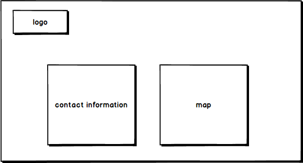

# Portfolio -Heng


## contents
1. The portfolio website link 
2. A link to the GitHub repository
3. Description of your portfolio website

  * Purpose
  * Functionality / features
  * Sitemap
  * Screenshots
  


## 1.The portfolio website link

```txt
caiheng.netlify.com
```

## 2.A link to the GitHub repository

```txt
https://github.com/Caiheng111/portfolio-heng
```

## 3.Description of your portfolio website


  * ***Functionality/features***
    * Home Page
    * About Page 
    * Skill Page 
    * Project Page 
    * Contact Page 
      


   * ***Design Sitemap***


  

  

  

  

  


   * ***Screenshots***

   1. home page

  

  2. skill page

  

  3. project page

  


  


